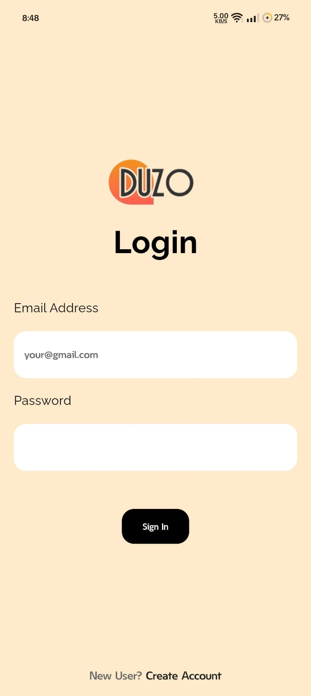
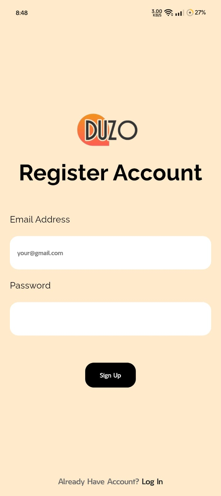
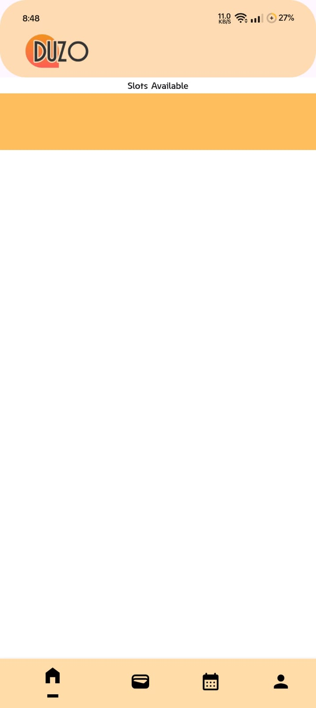
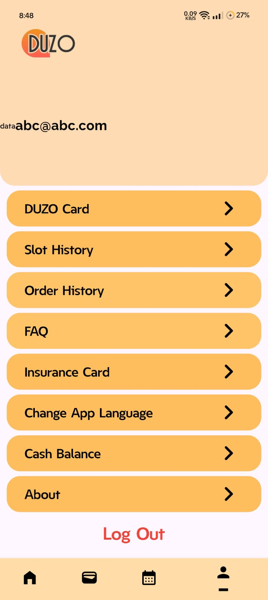

# Duzo

## Pages

> ### Splash Screen

> ### Login

> ### Signup

> ### Job Positions

> ### Details Page

> ### Applied pop up

> ### Learning dashboard

> ### Lecture and tests

> ### Home Page

> ### Earnings Page

> ### Calender

> ### Profile

***
***

## Backend

> ### user profile
> currently it is connected with email and password

> ### details fetching

> ### language

> ### order fetching

> ### location fetching

